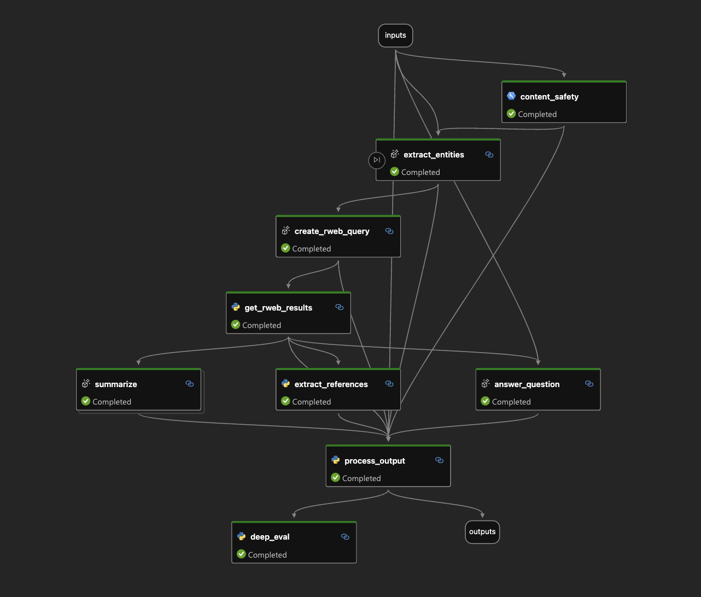

# Introduction

This repo contains sample code for workshops on using Promptflow as part of operationlizing LLMs for humanitarian response. The example flow does the following:

1. Extracts entities from user input and converts them to a query on ReliefWeb
2. Runs query again Reliefweb API to get situation reports for the user's request
3. Summarized the response
4. Extracts references 
5. Presents results to the user

The flow also includes:

1. Content safety filtering
2. Prompt variants
3. Dynamic grounding using deepeval

## Setup

1. Install [miniconda](https://docs.conda.io/en/latest/miniconda.html) by selecting the installer that fits your OS version. Once it is installed you may have to restart your terminal (closing your terminal and opening again)
2. In this directory, open terminal
3. `conda env create -f environment.yml`
4. `conda activate promtpflow-serve`

Promptflow can be run from the commandline, see [documentation](https://microsoft.github.io/promptflow/index.html) for further information, but a nice way to use it is to use VS Code which has a user interface for managing flows. To use this ..

1. Download [VS Code](https://code.visualstudio.com/download)
2. Install the [promptflow extension](https://marketplace.visualstudio.com/items?itemName=prompt-flow.prompt-flow)
3. Install the conda environment (see above)
4. Open a `flow.dag.yaml`
5. At top of file, click install dependencies
6. Select the conda environment `promptflow-serve`
7. Re-open `flow.dag.yaml`, select 'visual editor' at the top to see the lovely user interface
8. To run the flows click the play icon at the top of the promptflow user interface 

You will also need to configure LLM keys. The demo assumes Azure OpenAI, but scripts can also support OpenAI direct. To configure your LLM environment ...

1. Copy `.env.example` to `.env`
2. Set keys appropriately

