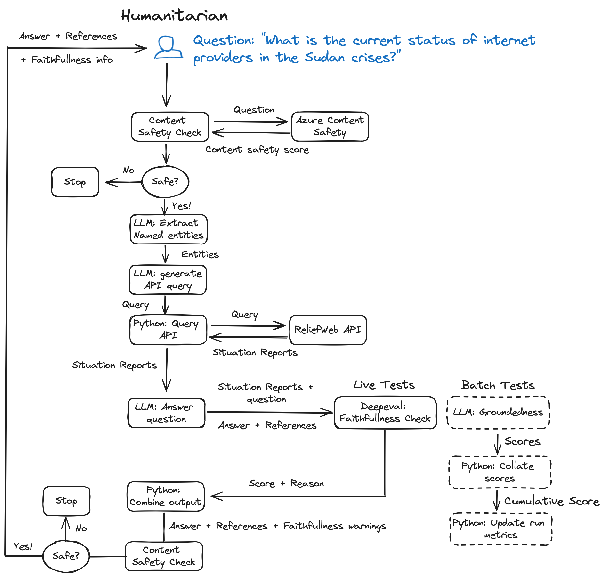

# Introduction

This repo contains sample code for using Promptflow as part of operationlizing LLMs for humanitarian response, as referenced in Blog post [A Humanitarian Crises Situation Report AI Assistant: Exploring LLMOps with Prompt Flow](https://medium.com/@astrobagel/a-humanitarian-crises-situation-report-ai-assistant-exploring-llmops-with-prompt-flow-32968b7a878b)

The example flow does the following ...

1. Extracts entities from user input and converts them to a query on [ReliefWeb](https://reliefweb.int/)
2. Runs query again Reliefweb API to get situation reports for the user's request
3. Summarized the response
4. Answers the user question
5. Extracts references 
6. Presents results to the user

It is a very basic app and hasn't been tuned for production use, more work would be needed for working with the ReliefWeb API. It is meant to demonstrate various things to consider when operationalizing LLM solutions. 

The flow also includes:

1. Content safety filtering
2. Prompt variants
3. Groundedness checks
4. Dynamic grounding using deepeval

And the repo includes GitHub actions to run ...

1. Promptflow automated groundedness tests
2. Code quality tests 

## Setup

For setup with screenshots, see also the blog post.

### Environment

1. Install [miniconda](https://docs.conda.io/en/latest/miniconda.html) by selecting the installer that fits your OS version. Once it is installed you may have to restart your terminal (closing your terminal and opening again)
2. In this directory, open terminal
3. `conda env create -f environment.yml`
4. `conda activate promtpflow-serve`

The repo should support both OpenAI and Azurer OpenAI depending on the variables set in the `.env` file. If you want
to test content safety, you will need to set up an Azure content safety instance, or dicoennect that connection in the flow and implement your own custom solution.

### Promptflow
Promptflow can be run from the commandline, see [documentation](https://microsoft.github.io/promptflow/index.html) for further information, but a nice way to use it is to use VS Code which has a user interface for managing flows. To use this ..

1. Download [VS Code](https://code.visualstudio.com/download)
2. Install the [promptflow extension](https://marketplace.visualstudio.com/items?itemName=prompt-flow.prompt-flow)
3. Install the conda environment (see above)
4. Open a `flow.dag.yaml`
5. At top of file, click install dependencies
6. Select the conda environment `promptflow-serve`
7. Re-open `flow.dag.yaml`, select 'visual editor' at the top to see the lovely user interface
8. To run the flows click the play icon at the top of the promptflow user interface 

You will also need to configure LLM keys. The demo assumes Azure OpenAI, but scripts can also support OpenAI direct. To configure your LLM environment ...

1. Copy `.env.example` to `.env`
2. Set keys appropriately

## Azure versus OpenAI

The code is configured to run with Azure OpenAI. You can also run with OpenAI directly as follows:

1. In promptflow, create a new OpenAI conntection (in VS code select 'P' promptflow on left,click + under connections). For command line creation, see `.github/test_deploy,yml`)

2. Set connection in all LLM nodes in the flow using VS code (click on them, change connection)

3. In `deep_eval.py` adjust code to use OpenAIChat instead of AzureOpenAI. At some point this will be a settings

Note, if using promptflow in Azure ML, you can explore other model connections. After creating an appropriate deployment, follow the steps above.

# Development

## Pre-commit hooks

The repo has been set up with black and flake8 pre-commit hooks. These can be configured in the `.pre-commit-config.yaml` file and initialized with `pre-commit autoupdate`.

On a new repo, you must run `pre-commit install` to add pre-commit hooks.

To run code quality tests, you can run `pre-commit run --all-files`

## Automatic testing using Promptflow

Automatic tests are run using Github actions, which creates a promptflow connection and executes a promptflow evaluation run. The output is monitored by a script, and can be used as a template for adding promptflow tests as part of DevOps. 

See `./github/workflows/test_deploy.yml` for more details, and 'Actions' in [the repo](https://github.com/datakind/promptflow_devops_example)
